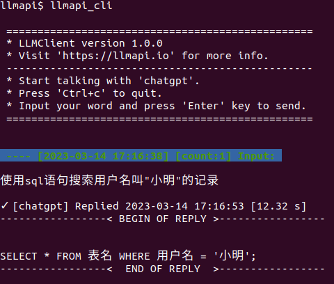

<p align="center">
  
  <h1 align="center">LLMApi Cli</h1>
  <p align="center">Talk to LLMs like ChatGPT in command line</p>

</p>

# Introduction

[中文文档](README.zh.md)

`llmapi_cli` is a command-line tool that can directly chat with `chatgpt`/`gpt3` and more large language models(LLM), based on the `llmapi-server` interface.
At the same time llmapi_cli also provides Python module (`LLMClient`).

> For more information visit: [llmapi.io](https://llmapi.io)

## Install

```bash
# install from pypi
python3 -m pip install llmapi_cli
```

```bash
# install locally
python3 setup.py install
```

## Usage

```bash
# The first time you use this command,
# you need to specify parameters, this 
# will be cached after successful connection.
#
# If you use your own llmapi-server:
llmapi_cli --host='http://127.0.0.1:5050' --bot=mock
#
# If you use api.llmapi.io (which is default host):
llmapi_cli --bot=mock --apikey='your apikey on llmapi.io'
```

```bash
# You can directly use this command again:
llmapi_cli
#
# Or change the bot type:
llmapi_cli --bot=gpt3
#
# Or redesignate params like first time.
```

### Screenshot


# Currently supported bot type

> View [llmapi-server](https://github.com/llmapi-io/llmapi-server) for more information.

Warning: Currently for testing only

 - `chatgpt`: openai's official ChatGPT,[see more](https://openai.com/blog/introducing-chatgpt-and-whisper-apis)
 - `gpt3`: openai's official GPT-3
 - `welm`: Tencent weixin's llm,[see more](https://welm.weixin.qq.com/docs/introduction/)
 - `newbing`: microsoft's new bing chat, `UNOFFICIAL INTERFACE`

